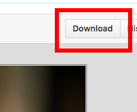

1. In Atom, right click on the "CSS" folder on the left pane and select "New Folder". Name the folder "images".
1. Navigate to our GitHub repository at [https://github.com/KansasCityWomeninTechnology/CSSCompilerPractice/tree/master/images](https://github.com/KansasCityWomeninTechnology/CSSCompilerPractice/tree/master/images). 
1. Click on each image filename to view the file. Then, click the "Download" button in the upper right corner above the displayed image.

    
1. Save the files into your "images" folder. 
	
	When you're done, your "images" folder should contain:
	```
	beer.jpg
	hero.jpg
	hot-cocktail.jpg
	margarita.jpg
	martini.jpg
	milk.jpg
	whiskey-cocktails.jpg
	wine.jpg
	```
1. In Atom, right click on the "CSS" project folder and create a new folder named "css" to house your stylesheet.
1. Right click on the "css" folder and create a file for your stylesheet. Name the file _styles.css_.
1. In Atom, open _index.html_. In the `head` section, between the `title` and `script` tags, link your stylesheet by adding 

   `<link rel="stylesheet" href="css/styles.css">`
1. Save your file.
1. Open your _index.html_ file in Google Chrome and notice the current styling.  

    
There's 2 different ways to open the file in Chrome. 
	
In Chrome, you can select **File** <i class="fa fa-long-arrow-right"></i> **Open File**. Navigate to your "CodingAndCocktails\CSS" folder and open the _index.html_ file. You can also use the keyboard shortcut `ctrl` + `o` on Windows machines.

Or you can navigate to "CodingAndCocktails\CSS" folder, right click on the _index.html_ file and choose "Open with". Select Google Chrome from the list.
	

The page doesn't look good yet but we've got our initial setup for our project done, now let's get to the fun part - styling!

